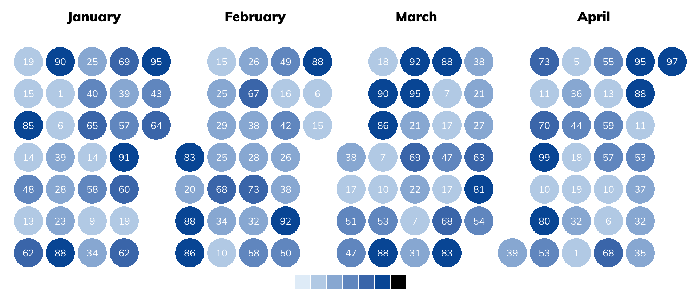
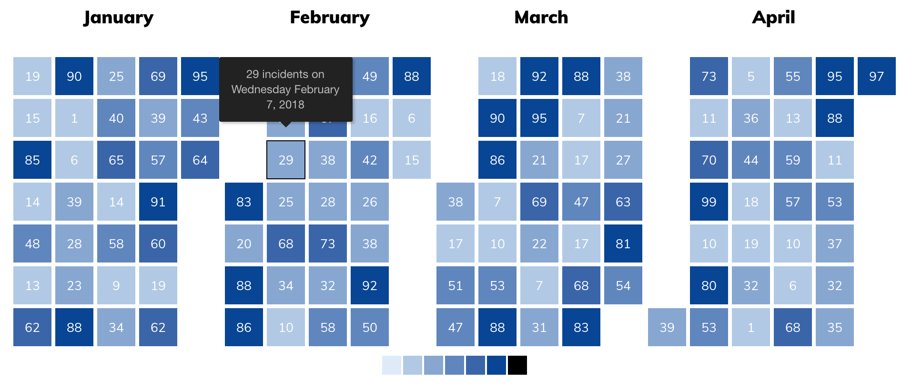

```{r pkg-knitr-opts, include=FALSE}
knitr::opts_chunk$set(collapse=TRUE, fig.retina=2, message=FALSE, warning=FALSE)
options(width=120)
```

[](https://travis-ci.org/hrbrmstr/supercaliheatmapwidget) 
[](https://codecov.io/gh/hrbrmstr/supercaliheatmapwidget)
[](https://cran.r-project.org/package=supercaliheatmapwidget)



# supercaliheatmapwidget

Supercalifragilistic HTML Calendar Heatmaps

## Description

The veritable Mary Poppins of interactive R calendar heatmaps.

## Why?

- Don't really need Vue or React
- Not interested in a lookalike github calendar thing
- Wanted to be able to use data frames and make the widget perform the data wrangling for me
- Wanted to use bare or quoted names for specifyin columns
- Needed a decent & free calendar widget for some 2019 projects

NOTE that this is a 3 hour old project as of the public push so it's going to have
corners rounded out and some things won't work.

## What's Inside The Tin

The following functions are implemented:

The widget itself:

- `supercal`:	Supercalifragilistic HTML Calendar Heatmaps

Styling helpers:

- `cal_colors`:	Construct a legend color object for calendar heatmap parameters
- `cal_label`:	Construct a margin object for calendar heatmap parameters
- `cal_legend`:	Modify the calendar heatmap legend
- `cal_margin`:	Construct a margin object for calendar heatmap parameters
- `cal_names`:	Construct a tooltip names object for the calender widget
- `cal_offset`:	Construct an offset object for calendar labels
- `cal_style`:	Add CSS styling rules to a calendar heatmap
- `label_cells`:	Display labels on calendar heatmap cells

Shiny stuff:

- `renderSupercaliheatmapwidget`:	Shiny bindings for supercaliheatmapwidget
- `supercaliheatmapwidget`:-shiny	Shiny bindings for supercaliheatmapwidget
- `supercaliheatmapwidgetOutput`:	Shiny bindings for supercaliheatmapwidget

## Installation

```{r install-ex, eval=FALSE}
devtools::install_git("https://git.sr.ht/~hrbrmstr/supercaliheatmapwidget")
# or 
devtools::install_gitlab("hrbrmstr/supercaliheatmapwidget")
# or
devtools::install_github("hrbrmstr/supercaliheatmapwidget")
```

## Usage

It's an htmlwidget so please go [here](https://rud.is/dl/supercaliheatmapwidget.html) to take a look.



## supercaliheatmapwidget Metrics

```{r cloc, echo=FALSE}
cloc::cloc_pkg_md()
```

## Code of Conduct

Please note that this project is released with a [Contributor Code of Conduct](CONDUCT.md). 
By participating in this project you agree to abide by its terms.
